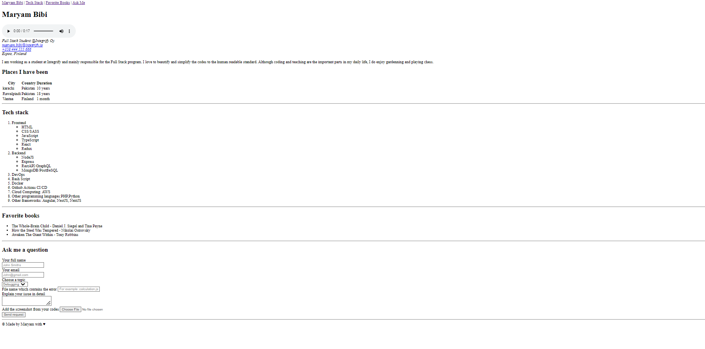

# Introduction

This project uses basic basic HTML elements to write short introduction of mine.

# Table of contents

 + Technologies
 + Project Structure
 + Getting Started
 
 # Technologies

 + HTML5

 # Project structure
   
   |-index.html
   |-intro.mp3
   |-README.md
 

## Result
 

## Output
[Visit website](https://maryam1122.github.io/Portofolio-Design-in-HTML/)
